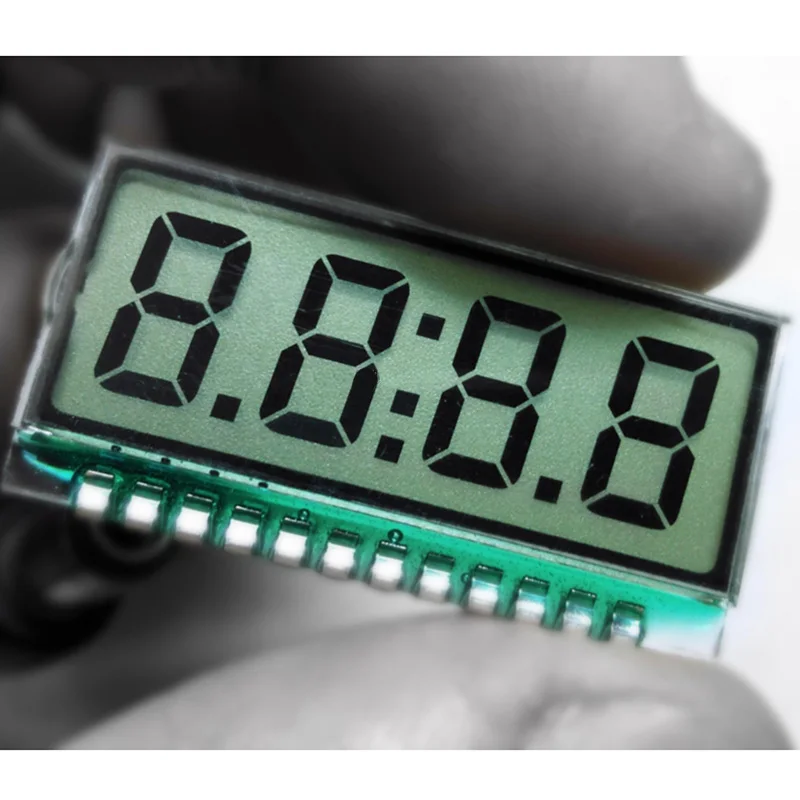
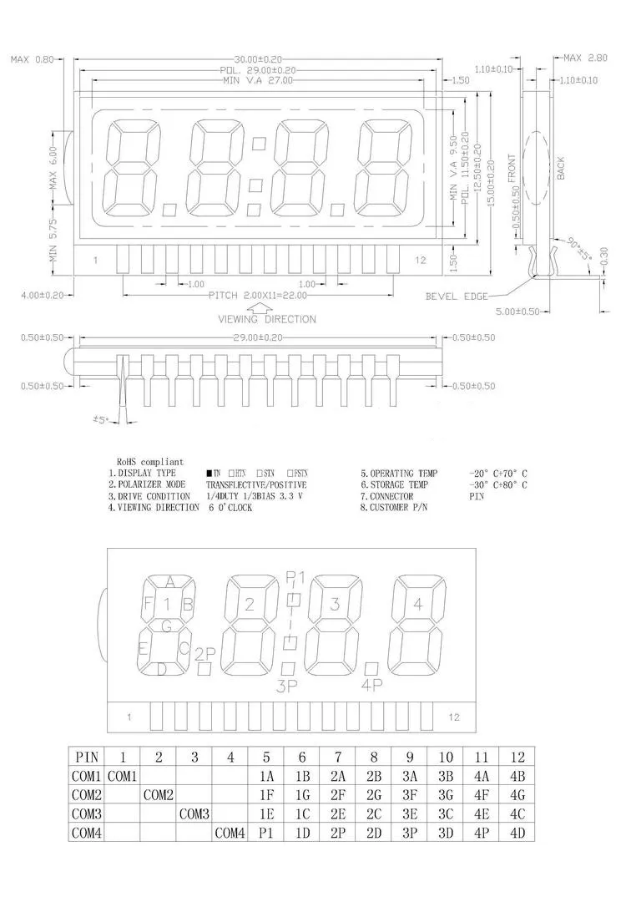
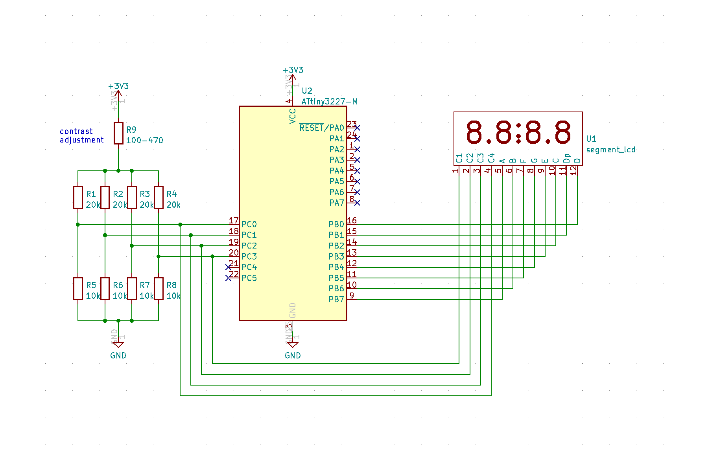

## Segment LCD driver
This program provide a driver and demostration code on how to drive a 4-digit segment LCD found in Aliexpress without a dedicated LCD driving IC/Controller. 

The "specification" from the Aliexpress indicated how the LCD should be connected and drive. 
 * The LCD has 4 COMs (COM1-COM4) and 8 multi-segment pins
 * The display has Drive Condition of: 1/4 Duty, 1/3 Bias, 3.3V

 

## Connection with MCU
The program uses an ATtiny3227 as the MCU for driving the segment LCD using GPIOs. The R9 on the following schematic provides the contrast control, the value of R1 should be adjusted based on personal preference and expected viewing angle. If the value of the resistor is higher than 470-ohm, the display might have difficulty to start-up. The R1 - R8 are 4 voltage dividers that provides the 1/3 bias voltage specified for each com pin.

## Battery Consumption
The demonstration code utilizes ATtiny3227 Power Down sleep mode to keep the overall power consumption as low as possible. The battery consumption for both ATtiny3227 and LCD is at about 3.5mA when running at 10MHz clock *without deep sleep*. The battery consumption drops to approximated 585uA *with Power Down deep sleep* implemented.

## Software
Code is written in bare metal by directly access and control the registers of Port B (for segments) and Port C (for com1 - com4). The demostration code implemented a counter counting from 0 to 9999. Refer to my blog post for more detail explanation on how the code work.

## Demo Video
Video demostration can be viewed from 

